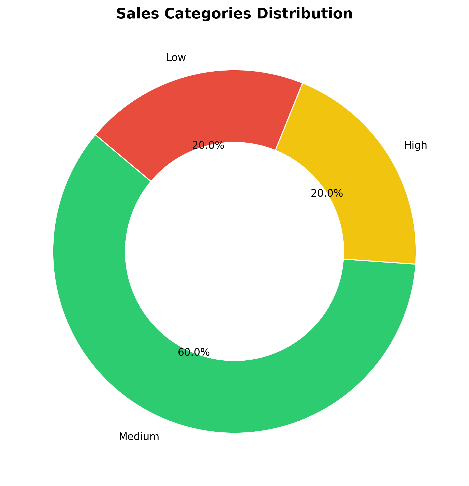
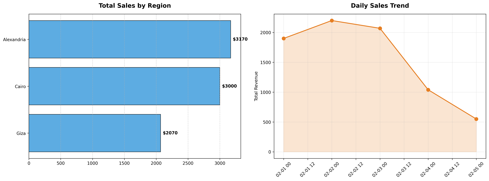

# 📊 Sales Performance Analysis (2026)

## 📋 Project Overview
This repository contains a comprehensive analysis of sales operations. The goal is to transform raw sales data into actionable business insights using **Python** and **Data Visualization** techniques.

---

## 🚀 Key Features
* **Data Cleaning:** Handling missing values and formatting dates.
* **Aggregated Metrics:** Grouping sales by category and region.
* **Professional Charts:** High-quality visualizations for stakeholder reporting.

---

## 💡 Business Insights & Visualizations

### 1️⃣ Sales Distribution Overview
This chart provides a deep dive into how sales are distributed across various segments, helping identify the most profitable areas.

---

### 2️⃣ Sales Summary & Trends
A visual summary of performance over time, highlighting growth patterns and seasonal peaks.

---

## 🛠️ Tech Stack
* **Language:** Python 3.x
* **Libraries:** Pandas, Matplotlib, Seaborn
* **Tools:** Jupyter Notebook / VS Code

---

## 📫 Contact Me
If you have any questions or want to collaborate, feel free to reach out via [LinkedIn](https://www.linkedin.com/in/ahmed-hany-el-sayed).
